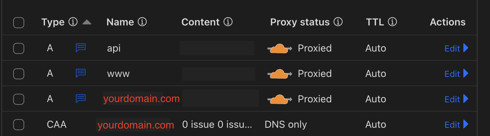
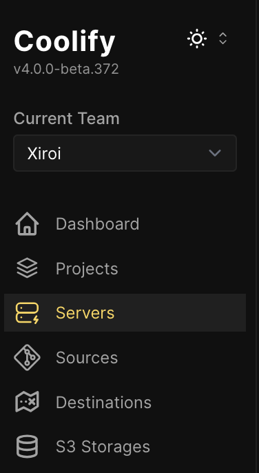
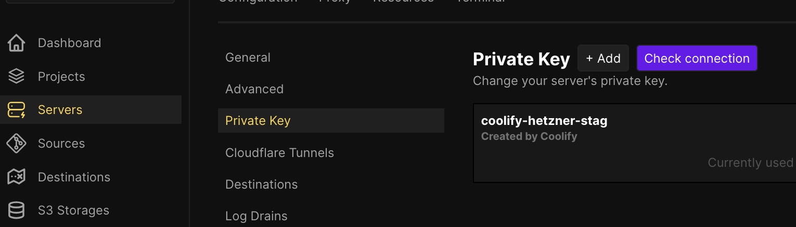
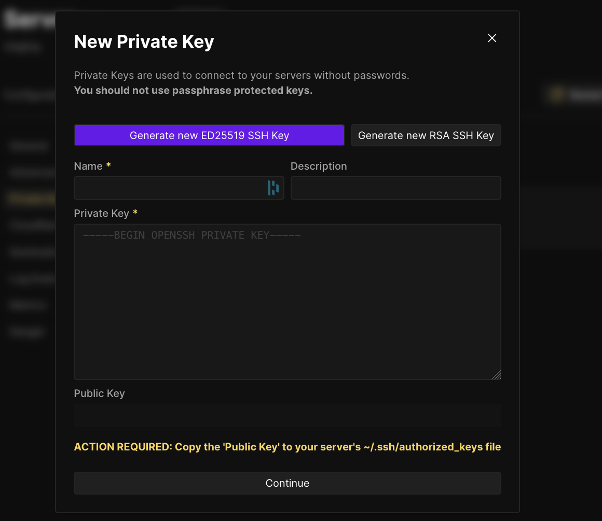
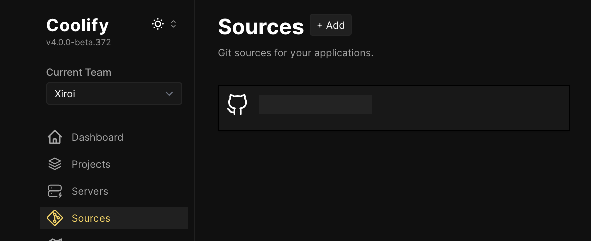
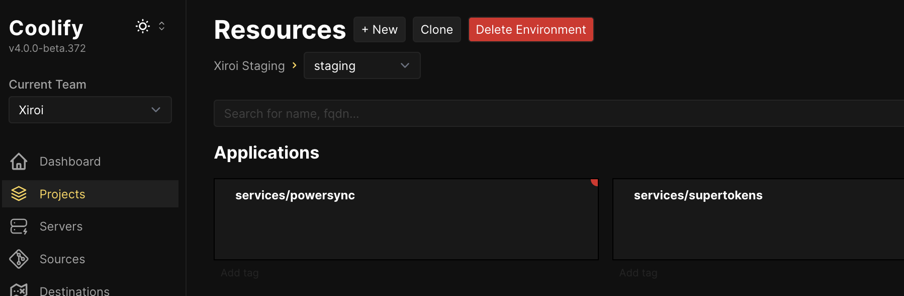
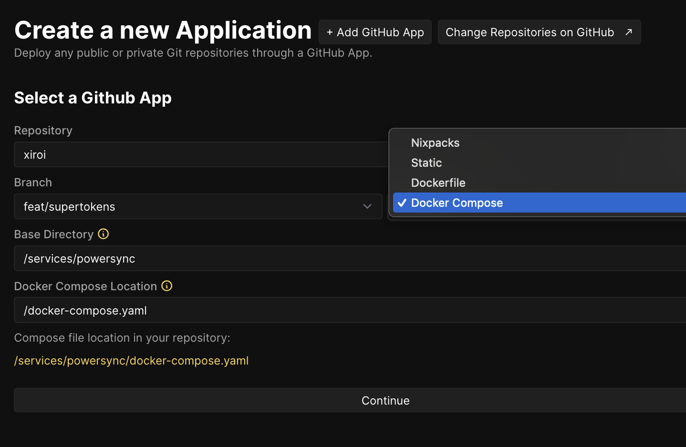

# VPS

Empower your software hosting it on a VPS (Virtual Private Server). Cheaper and portable.

If you want to replicate your localhost to staging/production, you can use this guide.

Self-hosted TypeScript apps I'm using:

- [Web] Vite React (<www.yourdomain.com>)
- [Server] NodeJS (api.yourdomain.com)

Self-hosted services I'm using:

- [VPS] Hetzner
- [Git] GitHub
- [Deployment] Coolify
- [Database] Postgres
- [Local-Cloud Sync] PowerSync
- [Auth] Supertokens

Other services:

- [Reverse Proxy] Traefik (configured in Coolify)
- [DNS, TLS, Protection] Cloudflare
- [Email] Docker Inbucket for local development (not VPS)
- [Postgres Migration] Flyway

For Postgres migration, I'm using [Flyway](https://flywaydb.org/).

## Content Table

- [0. Pre-requisites](#0-pre-requisites)
- [1. Create The Services Locally](#1-create-the-services-locally)
- [2. Setup VPS](#2-setup-vps)
- [3. Setup DNS & TLS](#3-setup-dns-tls)
- [4. Setup Coolify](#4-setup-coolify)
- [5. Deploy the Services to the VPS](#5-deploy-the-services-to-the-vps)

## [0. Pre-requisites](#0-pre-requisites)

1. [Local] Install on your laptop [Deno](https://deno.land/)
2. [Local] Install on your laptop [Docker Desktop](https://www.docker.com/products/docker-desktop/) or other, like [OrbStack](https://orbstack.dev/).
3. [Local] Configure `.env` files for your services (see `services/postgres/.env` for example)
4. Your domain connected to Cloudflare.

## [1. Create The Services Locally](#1-create-the-services-locally)

The local development environment uses Docker Compose to run multiple services. Each service is defined in its own directory under `services/` with its configuration files. The services include:

- **Postgres**: Main database for the application
- **PowerSync**: Data synchronization service with MongoDB
- **Supertokens**: Authentication service
- **Email**: Local email testing with Inbucket

All services are managed through Deno tasks for consistent command execution:

```bash
# Important: Run all commands from the root directory of the project
# cd scripts/services

# Start all services
deno task docker:up

# Start specific services
deno task docker:up postgres
deno task docker:up email powersync

# Stop all services
deno task docker:down

# Restart services
deno task docker:restart

# Clean volumes
deno task docker:clean          # Clean all volumes
deno task docker:clean postgres # Clean specific service volumes

# Setup PowerSync (usually automatic)
deno task docker:setup_powersync
```

### Services Structure

Services are defined in `scripts/services/types.ts`:

- `email`
- `postgres`
- `powersync`
- `supertokens`

### Important Notes

1. Services start in a specific order to handle dependencies
2. When starting `postgres`, PowerSync setup runs automatically
3. All commands are idempotent - safe to run multiple times
4. Health checks run automatically to verify service status

## [2. Setup The VPS](#2-setup-the-vps)

1. [Create VPS on Hetzner](https://docs.hetzner.com/cloud/servers/getting-started/creating-a-server) (cheaper than AWS; [link 2](https://tech.ahrefs.com/how-ahrefs-saved-us-400m-in-3-years-by-not-going-to-the-cloud-8939dd930af8). [link 2](https://learn.umh.app/course/aws-and-azure-are-at-least-4x-10x-more-expensive-than-hetzner/)). Debian.
2. Connect to your Hetzner VPS with SSH. Guide <https://docs.hetzner.com/cloud/servers/getting-started/connecting-to-the-server/>
3. Update and upgrade Debian packages.

```bash
sudo apt update && sudo apt upgrade -y
```

## [3. Setup DNS & TLS](#3-setup-dns-tls)

[!CAUTION] Work in progress

1. Enable TLS Strict mode on Cloudflare <https://developers.cloudflare.com/ssl/origin-configuration/ssl-modes/full-strict/>
2. Create a Cloudflare Origin CA <https://developers.cloudflare.com/ssl/origin-configuration/origin-ca/>
3. Setup a DNS record for your domain pointing to your VPS.
4. Obtain API Token from Cloudflare and update Traefik .env



## [4. Setup Coolify](#4-setup-coolify)

Use cloud or self-hosted. I'm using the cloud (only $5/month).

1. Create a Coolify account.
2. Create a new server in an Staging or Production environment. My case is Staging.

   

3. Create a SSH key automatically with the "Generate new Ed25519 SSH key" function.

   To allow Coolify to connect to your VPS, you need to create a SSH key. I prefer to use a different one than my laptop (in step #1).

   
   

4. I'm using the root user automatically created by the VPS. Note that this is not recommended for production. Coolify has a beta feature to allow other users.
5. Create a source with GitHub Apps to connect Coolify to your repository.

   

## [5. Deploy the Services to the VPS](#5-deploy-the-services-to-the-vps)

1. Create a new resource on Coolify via the source you created in the previous step (GitHub Apps).

   

2. Select (Docker Compose instead of Nixpacks). Remember to write the branch you want to deploy.

   

3. Check `.env.example` of this repo `Environment Variables` of the resource --> `Production`. Add the missing variables to Coolify.

4. Create Docker network (found in `docker-compose.yaml` files) in the VPS using SSH terminal. This is to allow the services to communicate with each other.

   ```bash
   docker network create backend_network
   ```

5. Deploy the service.

6. Do this for each service (PowerSync, Supertokens, Postgres).

## Troubleshooting

### Local Development

1. Check Docker logs: `docker logs <container_name>`
2. Verify environment variables in service `.env` files
3. Use `deno task docker:down` followed by `deno task docker:up` to reset services
4. Clean volumes if database issues occur: `deno task docker:clean`

### VPS Deployment

1. Check Coolify logs for deployment issues
2. Verify network configuration
3. Ensure all environment variables are set correctly
4. Check Cloudflare DNS and SSL/TLS settings

## Todo

- Web and server sample apps.
- Add Traefik for reverse proxy to Coolify.
